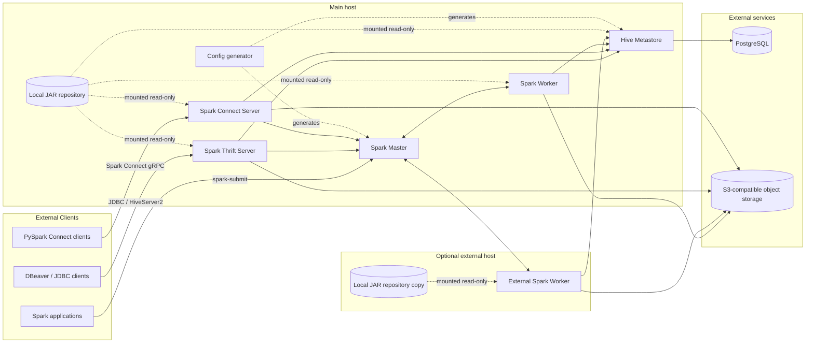

# Spark Lakehouse PoC

Container-based Spark Lakehouse Proof of Concept with Apache Spark, Hive Metastore, PostgreSQL, S3-compatible storage, Delta Lake, Iceberg, Spark Thrift Server and Spark Connect.

This repository provides a reproducible container-based Data Lakehouse environment intended for local labs, PoCs and small-scale validation of Spark-based Lakehouse architectures. It is designed to run with either Docker Compose or Podman Compose and to expose Spark services through host networking so that external Spark clients and external Spark workers can join the cluster using real host IP addresses.

The current deployment intentionally keeps the following services external:

- PostgreSQL, used as the Hive Metastore backend database.
- S3-compatible object storage, used as the Lakehouse data warehouse.

It also intentionally avoids downloading runtime JARs from Maven at container startup. All required JARs are downloaded ahead of time into a local directory and mounted read-only into the containers.

---

## Table of Contents

- [Architecture](#architecture)
- [Components](#components)
- [Repository Layout](#repository-layout)
- [Software Versions](#software-versions)
- [Container Images](#container-images)
- [Local JAR Repository](#local-jar-repository)
- [Prerequisites](#prerequisites)
- [Configuration](#configuration)
- [Prepare Local JARs](#prepare-local-jars)
- [Start the Main Lakehouse Node](#start-the-main-lakehouse-node)
- [Start an External Spark Worker](#start-an-external-spark-worker)
- [Access Points](#access-points)
- [Quick Tests](#quick-tests)
- [DBeaver / JDBC Access](#dbeaver--jdbc-access)
- [Spark Connect Access](#spark-connect-access)
- [Operational Notes](#operational-notes)
- [Troubleshooting](#troubleshooting)
- [Roadmap](#roadmap)

---

## Architecture

The PoC is built around Apache Spark Standalone mode, using Hive Metastore as the shared catalog and S3-compatible object storage as the table storage layer.



### Design Principles

1. **Container-based, not orchestrator-specific**  
   The deployment is designed to work with Docker Compose and Podman Compose.

2. **Externalized stateful services**  
   PostgreSQL and S3-compatible storage are external to this compose stack. This keeps the Spark/Hive PoC focused and avoids tying the metadata database or object storage lifecycle to the Spark cluster lifecycle.

3. **No runtime Maven dependency downloads**  
   JARs are downloaded in advance with `prepare_lakehouse_jars_local.sh` and mounted into containers from a local directory.

4. **External Spark connectivity**  
   The cluster uses host networking and advertised public host/IP values so external clients and external workers can communicate with Spark services without Docker-internal names or container-only IP addresses.

5. **Lakehouse table format support**  
   Delta Lake and Apache Iceberg are both available from the same Spark runtime.

---

## Components

| Component | Purpose |
|---|---|
| Spark Master | Spark Standalone cluster manager and scheduler. |
| Spark Worker | Local worker running on the main host. |
| External Spark Worker | Optional worker running on a different physical or virtual host. |
| Spark Thrift Server | JDBC/ODBC SQL access, suitable for tools such as DBeaver or BI clients. |
| Spark Connect Server | Remote DataFrame API access through Spark Connect. |
| Hive Metastore | Shared catalog service for Spark SQL, Delta metadata registration and Iceberg Hive catalog. |
| PostgreSQL | External database used by Hive Metastore. Not deployed by this compose stack. |
| S3-compatible storage | External object storage used as the Lakehouse data warehouse. Not deployed by this compose stack. |
| Local JAR repository | Local dependency directory mounted into containers to avoid runtime Maven downloads. |

---

## Repository Layout

Recommended layout:

```text
.
├── docker-compose.yaml
├── docker-compose_worker.yaml
├── env
├── env_worker
├── hive-ivy-urls.txt
├── prepare_lakehouse_jars_local.sh
├── README.md
└── lakehouse-jars/                 # generated, do not commit large JARs
    ├── spark/
    ├── connect/
    ├── hive/
    ├── ivy/
    └── manifest/
```

### Main Files

| File | Description |
|---|---|
| `docker-compose.yaml` | Main Lakehouse deployment: config generator, Hive Metastore, Spark Master, local Worker, Thrift Server and Spark Connect Server. |
| `docker-compose_worker.yaml` | Optional external Spark Worker deployment for a separate host. |
| `env` | Main host environment template. Copy to `.env` before running. |
| `env_worker` | External worker environment template. Copy to `.env` on the worker host. |
| `prepare_lakehouse_jars_local.sh` | Downloads all required runtime JARs into a local directory. |
| `hive-ivy-urls.txt` | Frozen list of Hive Metastore client transitive dependencies. |

---

## Software Versions

The PoC currently uses the following software versions.

| Software / Dependency | Version | Used by |
|---|---:|---|
| Apache Spark | 3.5.6 | Master, Workers, Thrift Server, Spark Connect |
| Hive Metastore | 3.1.3 | Hive Metastore service and Spark Hive client configuration |
| Delta Lake | 3.3.2 | Spark SQL Delta support |
| Apache Iceberg Spark Runtime | 1.9.2 | Spark SQL Iceberg support with Spark 3.5 / Scala 2.12 |
| PostgreSQL JDBC Driver | 42.7.11 | Hive Metastore database connectivity |
| Hadoop AWS for Spark | 3.3.4 | S3A support in Spark containers |
| AWS Java SDK Bundle for Spark | 1.12.262 | S3A support in Spark containers |
| Hadoop AWS for Hive Metastore | 3.1.0 | S3A support in Hive Metastore container |
| AWS Java SDK Bundle for Hive Metastore | 1.11.271 | S3A support in Hive Metastore container |
| Spark Connect JAR | 3.5.6 | Spark Connect Server |
| Spark `unused` marker JAR | 1.0.0 | Spark Connect dependency marker |
| Alpine Linux | 3.20 | Configuration helper container |

Notes:

- Iceberg `1.9.2` is selected because it is suitable for the Java runtime used by the Spark 3.5.6 image in this PoC.
- PostgreSQL itself is external. The table above lists the JDBC driver bundled into the local Hive Metastore JAR directory.
- S3-compatible storage is external. MinIO, Dell ObjectScale, AWS S3 or another S3-compatible endpoint can be used if S3A access is correctly configured.

---

## Container Images

The following public container images are required by the compose files:

| Image | Used by | Notes |
|---|---|---|
| `alpine:3.20` | `lakehouse-config`, `lakehouse-worker-config` | Lightweight container used to generate Spark/Hive configuration files. |
| `apache/hive:3.1.3` | `hive-metastore-init`, `hive-metastore` | Hive Metastore schema initialization and service runtime. |
| `apache/spark:3.5.6` | `spark-master`, `spark-worker`, `spark-thrift`, `spark-connect`, external workers | Spark runtime image used across all Spark services. |

This compose stack does **not** deploy PostgreSQL or MinIO. If you want to run those services as containers for a fully local demo, add them separately or use an external stack.

To pre-pull the required images:

```bash
docker pull alpine:3.20
docker pull apache/hive:3.1.3
docker pull apache/spark:3.5.6
```

With Podman:

```bash
podman pull docker.io/library/alpine:3.20
podman pull docker.io/apache/hive:3.1.3
podman pull docker.io/apache/spark:3.5.6
```

---

## Local JAR Repository

The runtime dependency strategy is intentionally local.

The script `prepare_lakehouse_jars_local.sh` downloads all required JARs into `${LOCAL_JARS_DIR}`. By default:

```text
./lakehouse-jars
```

Expected structure:

```text
lakehouse-jars/
├── spark/
│   ├── hadoop-aws-3.3.4.jar
│   ├── aws-java-sdk-bundle-1.12.262.jar
│   ├── delta-spark_2.12-3.3.2.jar
│   ├── delta-storage-3.3.2.jar
│   └── iceberg-spark-runtime-3.5_2.12-1.9.2.jar
├── connect/
│   ├── org.apache.spark_spark-connect_2.12-3.5.6.jar
│   └── org.spark-project.spark_unused-1.0.0.jar
├── hive/
│   ├── postgresql-42.7.11.jar
│   ├── hadoop-aws-3.1.0.jar
│   └── aws-java-sdk-bundle-1.11.271.jar
├── ivy/
│   └── frozen Hive 3.1.3 metastore client dependency set
└── manifest/
    ├── jars-relative.txt
    ├── spark-jars.txt
    ├── connect-jars.txt
    ├── hive-jars.txt
    ├── ivy-jars.txt
    ├── sha256sum.txt
    └── summary.txt
```

Why this structure exists:

- `spark/` contains generic Spark runtime dependencies shared by Spark Master, Workers, Thrift Server and Spark Connect.
- `connect/` contains JARs used only by Spark Connect.
- `hive/` contains JARs required by the Hive Metastore JVM process itself.
- `ivy/` contains the frozen dependency set used by Spark to create a Hive 3.1.3-compatible metastore client classloader.
- `manifest/` documents what was downloaded.

The containers mount the local repository read-only at:

```text
/opt/lakehouse/jars
```

---

## Prerequisites

### Main Host

- Linux host recommended.
- Docker Engine with Compose v2, or Podman with Podman Compose.
- Access to an external PostgreSQL database.
- Access to an external S3-compatible object store.
- `curl`, `sed`, `find` and `sort` installed locally for the JAR preparation script.
- Enough CPU/RAM for the selected Spark worker configuration.

### External Worker Host

- Docker or Podman.
- Network connectivity to the Spark Master public host and port.
- Network connectivity to the Hive Metastore public host and port.
- Network connectivity to the S3-compatible storage endpoint.
- A local copy of the same `lakehouse-jars/` directory.

---

## Configuration

Create the main `.env` file:

```bash
cp env .env
```

Edit `.env` and set at least the following values:

```env
S3_ENDPOINT="https://s3.example.com"
S3_SSL_ENABLED="true"
S3_PATH_STYLE_ACCESS="true"
S3_WAREHOUSE="s3a://lakehouse/data"
AWS_REGION="us-east-1"
AWS_ACCESS_KEY_ID="CHANGE_ME"
AWS_SECRET_ACCESS_KEY="CHANGE_ME"

POSTGRES_HOST="192.168.1.101"
POSTGRES_PORT="5432"
POSTGRES_DB="hive"
POSTGRES_USER="hive"
POSTGRES_PASSWORD="CHANGE_ME"

SPARK_PUBLIC_HOST="192.168.1.101"
LOCAL_JARS_DIR="./lakehouse-jars"
```

Important:

- Do not use `localhost` for `SPARK_PUBLIC_HOST` if external clients or external workers will connect.
- Use the host IP address or a DNS name that is reachable from clients and worker hosts.
- Do not commit `.env` files containing real credentials.

---

## Prepare Local JARs

Run this on the main host before starting the services:

```bash
chmod +x prepare_lakehouse_jars_local.sh
./prepare_lakehouse_jars_local.sh
```

This creates the local JAR repository:

```bash
find lakehouse-jars -maxdepth 2 -type f | sort | head
cat lakehouse-jars/manifest/summary.txt
```

If you want to force a clean redownload:

```bash
CLEAN_JARS=true ./prepare_lakehouse_jars_local.sh
```

The script does not use S3, AWS CLI, Docker, Spark, Ivy or Python. It downloads direct Maven artifacts and the frozen Hive client dependency set from `hive-ivy-urls.txt`.

---

## Start the Main Lakehouse Node

With Docker Compose:

```bash
docker compose --env-file .env up -d
```

With Podman Compose:

```bash
podman compose --env-file .env up -d
```

Check containers:

```bash
docker compose --env-file .env ps
```

Or with Podman:

```bash
podman compose --env-file .env ps
```

Check logs:

```bash
docker logs lakehouse-config
docker logs lakehouse-hive-metastore-init
docker logs lakehouse-hive-metastore
docker logs lakehouse-spark-master
docker logs lakehouse-spark-worker-1
docker logs lakehouse-spark-thrift
docker logs lakehouse-spark-connect
```

---

## Start an External Spark Worker

On the external worker host, copy the worker compose and environment files:

```bash
cp env_worker .env
```

Edit `.env`:

```env
SPARK_MASTER_HOST="192.168.1.101"
SPARK_MASTER_PORT="7077"
SPARK_WORKER_PUBLIC_HOST="192.168.1.11"
LOCAL_JARS_DIR="./lakehouse-jars"
```

Copy the local JAR repository from the main host:

```bash
rsync -av lakehouse-jars/ 192.168.1.11:/path/to/project/lakehouse-jars/
```

Start the external worker:

```bash
docker compose -f docker-compose_worker.yaml --env-file .env up -d
```

With Podman:

```bash
podman compose -f docker-compose_worker.yaml --env-file .env up -d
```

Check the worker logs:

```bash
docker logs lakehouse-external-worker-192-168-1-11
```

The Spark Master UI should show the external worker registered with its advertised public address.

---

## Access Points

Default ports from the main `.env` file:

| Service | Default URL / endpoint | Purpose |
|---|---|---|
| Spark Master RPC | `spark://<SPARK_PUBLIC_HOST>:7077` | Spark Standalone cluster endpoint. |
| Spark Master UI | `http://<SPARK_PUBLIC_HOST>:8080` | Cluster UI. |
| Spark Worker UI | `http://<SPARK_PUBLIC_HOST>:8081` | Local worker UI. |
| Hive Metastore | `thrift://<SPARK_PUBLIC_HOST>:9083` | Metastore Thrift API. |
| Spark Thrift Server | `jdbc:hive2://<SPARK_PUBLIC_HOST>:10000/default` | SQL/JDBC access. |
| Spark Thrift UI | `http://<SPARK_PUBLIC_HOST>:4040` | Spark UI for Thrift Server application. |
| Spark Connect | `sc://<SPARK_PUBLIC_HOST>:15002` | Spark Connect gRPC endpoint. |
| Spark Connect UI | `http://<SPARK_PUBLIC_HOST>:4050` | Spark UI for Spark Connect application. |

---

## Quick Tests

### Test Spark Master

Open:

```text
http://<SPARK_PUBLIC_HOST>:8080
```

You should see at least one registered worker.

### Submit a Small Spark Job

Example using a Python file in S3:

```bash
docker exec -it lakehouse-spark-master /opt/spark/bin/spark-submit \
  --master spark://<SPARK_PUBLIC_HOST>:7077 \
  --deploy-mode client \
  --conf spark.app.name="Spark Pi test" \
  --conf spark.executor.instances=2 \
  --conf spark.executor.cores=1 \
  --conf spark.executor.memory=512m \
  --conf spark.executor.memoryOverhead=256m \
  --conf spark.cores.max=2 \
  --conf spark.driver.memory=512m \
  --conf spark.driver.host=<SPARK_PUBLIC_HOST> \
  --conf spark.driver.bindAddress=<SPARK_PUBLIC_HOST> \
  --conf spark.driver.port=39010 \
  --conf spark.blockManager.port=39011 \
  s3a://lakehouse/python/spark_pi.py \
  4 25000
```

### Test SQL through Beeline

```bash
docker exec -it lakehouse-spark-thrift /opt/spark/bin/beeline \
  -u "jdbc:hive2://<SPARK_PUBLIC_HOST>:10000/default" \
  -n spark
```

Inside Beeline:

```sql
SHOW DATABASES;
SELECT 1;
```

### Create a Delta Table

```sql
CREATE DATABASE IF NOT EXISTS test;

CREATE TABLE IF NOT EXISTS test.test_delta (
  id INT,
  name STRING
)
USING delta;

INSERT INTO test.test_delta VALUES
  (1, 'from spark thrift'),
  (2, 'delta table');

SELECT * FROM test.test_delta;
```

### Create an Iceberg Table

Use the explicit Iceberg catalog:

```sql
CREATE NAMESPACE IF NOT EXISTS iceberg.test;

CREATE TABLE IF NOT EXISTS iceberg.test.test_iceberg (
  id INT,
  name STRING
)
USING iceberg
TBLPROPERTIES (
  'format-version' = '2'
);

INSERT INTO iceberg.test.test_iceberg VALUES
  (1, 'from spark thrift'),
  (2, 'iceberg table');

SELECT * FROM iceberg.test.test_iceberg;
```

---

## DBeaver / JDBC Access

Create a new Apache Hive connection in DBeaver:

```text
Host: <SPARK_PUBLIC_HOST>
Port: 10000
Database: default
JDBC URL: jdbc:hive2://<SPARK_PUBLIC_HOST>:10000/default
Authentication: No Authentication
User: spark
Password: empty
```

Recommended first queries:

```sql
SHOW DATABASES;
SHOW TABLES IN test;
SELECT 1;
```

For DDL statements such as `CREATE TABLE`, DBeaver may sometimes try to fetch rows from a statement that does not return a regular result set. If a table is created successfully but DBeaver shows a fetch-related warning, validate with:

```sql
SHOW TABLES IN test;
DESCRIBE EXTENDED test.test_delta;
```

---

## Spark Connect Access

Install a matching PySpark client version on the client machine:

```bash
pip install "pyspark[connect]==3.5.6"
```

Example client:

```python
from pyspark.sql import SparkSession

spark = (
    SparkSession.builder
    .remote("sc://<SPARK_PUBLIC_HOST>:15002")
    .appName("spark-connect-client-test")
    .getOrCreate()
)

try:
    spark.sql("SHOW DATABASES").show()
finally:
    spark.stop()
```

Spark Connect server JARs are loaded from:

```text
lakehouse-jars/connect/
```

The compose file intentionally does not use `--packages` for Spark Connect, so the service does not download dependencies from Maven at startup.

---

## Operational Notes

### Host Networking

The compose files use `network_mode: host` so Spark can advertise real host addresses. This is important when:

- submitting Spark jobs from outside the container host,
- using DBeaver or other JDBC clients externally,
- running Spark workers on other physical hosts,
- exposing Spark Connect externally.

This approach works best on Linux hosts. Docker Desktop platforms may have different host networking behavior.

### Local JAR Directory on Every Worker Host

Every host running a Spark worker must have the local JAR directory available at the path configured by `LOCAL_JARS_DIR`.

For example:

```text
LOCAL_JARS_DIR="./lakehouse-jars"
```

The worker compose file mounts it into the worker container as:

```text
/opt/lakehouse/jars
```

### Worker Removal

Spark Standalone may show removed workers as `DEAD` in the Spark Master UI for a while. This is normal. To reduce the time Spark keeps dead workers visible, configure:

```env
SPARK_DEAD_WORKER_PERSISTENCE=0
```

or restart the Spark Master during a maintenance window.

### Resource Allocation

There are two different resource layers:

1. Container resource limits, such as `SPARK_WORKER_CONTAINER_CPUS` and `SPARK_WORKER_CONTAINER_MEMORY`.
2. Spark-advertised resources, such as `SPARK_WORKER_CORES` and `SPARK_WORKER_MEMORY`.

The Thrift Server and Spark Connect Server are intentionally configured with a small Spark footprint so they do not reserve the full cluster.

---

## Troubleshooting

### JAR repository missing

If a service waits for JARs and never starts, verify:

```bash
ls -lh lakehouse-jars/spark
ls -lh lakehouse-jars/connect
ls -lh lakehouse-jars/hive
ls -lh lakehouse-jars/ivy | head
cat lakehouse-jars/manifest/summary.txt
```

### S3A class not found

If you see:

```text
ClassNotFoundException: org.apache.hadoop.fs.s3a.S3AFileSystem
```

verify that these files exist in `lakehouse-jars/spark/`:

```text
hadoop-aws-3.3.4.jar
aws-java-sdk-bundle-1.12.262.jar
```

and that `LOCAL_JARS_DIR` points to the correct local directory.

### Hive Metastore cannot connect to PostgreSQL

Check:

```bash
docker logs lakehouse-hive-metastore-init
docker logs lakehouse-hive-metastore
```

Then validate network connectivity from the host:

```bash
nc -vz <POSTGRES_HOST> <POSTGRES_PORT>
```

### Spark Connect starts downloading from Maven

This should not happen in the current design. Verify that the service uses local JARs from:

```text
/opt/lakehouse/jars/connect/
```

and that the compose command does not contain `--packages`.

### External worker does not register

From the external worker host:

```bash
nc -vz <SPARK_MASTER_HOST> 7077
```

From the main host:

```bash
nc -vz <SPARK_WORKER_PUBLIC_HOST> 7078
```

Also verify that the worker is not advertising `localhost` or a container-only IP.

---

## Roadmap

Potential next steps:

- Add optional compose profiles for local PostgreSQL and local MinIO.
- Add Apache Superset or another SQL UI.
- Add authentication and authorization integration.
- Add TLS support for Spark Thrift Server and Spark Connect.
- Add metrics and observability with Prometheus and Grafana.
- Add CI validation for Compose syntax and local JAR manifest integrity.
- Add example notebooks and SQL test suites for Delta and Iceberg.

---

## License

Add your preferred license here.

---

## Author

Jorge Florencio  
Data Architect
